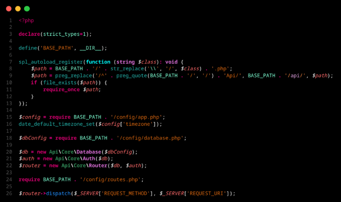

# Blank's Theme Reborn

The goal is simple: Good distinctions, and cool :P

## What's New?

* New Syntax color palette
* Cleaner UI.
* Fewer colors for consistency

## Preview

---

---

## Installation

1. Search for **Blank's Theme Reborn** in extensions.
2. Install and select.
3. Code.
